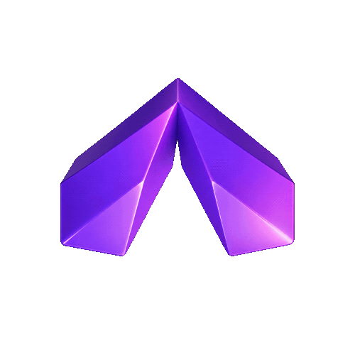

<div align="center">

# ⚡ Valence Protocol
### Autonomous, Guardrailed DCA Protocol for Tokenized Equities on Robinhood Chain

[](https://robinhoodchain.blockscout.com)
[](https://nextjs.org)
[](https://openserv.ai)
[](https://github.com/Uniswap/permit2)
[](LICENSE)

<br />

<p align="center">
  
</p>

<p align="center">
  <strong>Institutional-grade algorithmic dollar-cost averaging into tokenized US equities (NVDA, TSM, AVGO, MSFT) powered by SERV reasoning agents, deterministic risk guardrails, and non-custodial Robinhood Chain L2 smart contracts.</strong>
</p>

[Explore Live Protocol](https://robinhoodchain.blockscout.com/address/0x71C43939626A3b8A88a8f1B5D34559828e184e8B) • [Audit Ledger](/activity) • [Architecture](#-system-architecture) • [Protocol Revenue](#-sustainable-protocol-revenue)

</div>

---

## 📑 Table of Contents
- [Executive Overview](#-executive-overview)
- [How It Works: Step-by-Step Flow](#-how-it-works-step-by-step-flow)
- [Frequently Asked Questions (Investor & User Guide)](#-frequently-asked-questions-investor--user-guide)
  - [1. Where do I view my tokenized stocks?](#1-where-do-i-view-my-tokenized-stocks)
  - [2. How do I know if the stock price is increasing?](#2-how-do-i-know-if-the-stock-price-is-increasing)
  - [3. How do I withdraw or liquidate back to cash/ETH?](#3-how-do-i-withdraw-or-liquidate-back-to-casheth)
- [System Architecture](#-system-architecture)
- [Core Innovation Pillars](#-core-innovation-pillars)
  - [1. SERV & Guild AI Autonomous Reasoning](#1-serv--guild-ai-autonomous-reasoning)
  - [2. Deterministic Risk Guardrails](#2-deterministic-risk-guardrails)
  - [3. Non-Custodial Vault & Permit2](#3-non-custodial-vault--permit2)
  - [4. Sustainable Protocol Revenue Model](#4-sustainable-protocol-revenue-model)
- [Robinhood Chain L2 Specifications](#-robinhood-chain-l2-specifications)
- [Tech Stack](#-tech-stack)
- [Getting Started Locally](#-getting-started-locally)
- [Contract Addresses & Verification](#-contract-addresses--verification)
- [License](#-license)

---

## 🏛 Executive Overview

Traditional retail equity investing is encumbered by high management fees, custodial lock-in, and emotional market timing. On-chain investing solves custody but introduces volatility and lack of disciplined asset allocation.

**Valence Protocol** bridges this divide by delivering an autonomous, non-custodial DCA (Dollar Cost Averaging) protocol on **Robinhood Chain (Chain ID: 4663)**. Users define high-level investment theses (e.g. *"$50/week into AI & Semiconductors"*), and Valence handles macro analysis, risk-boundary validation, batched execution, and rebalancing without ever taking custody of user keys.

---

## 🔄 How It Works: Step-by-Step Flow

```
┌─────────────────────────┐
│ User Investment Goal    │  e.g. "$50/week into AI & Semiconductors"
└────────────┬────────────┘
             │
             ▼
┌─────────────────────────┐
│ OpenServ / Guild AI     │  1. Macro sentiment analysis & sector valuation
│ Reasoning Engine        │  2. Generates candidate asset basket (NVDA, TSM, etc.)
└────────────┬────────────┘
             │
             ▼
┌─────────────────────────┐
│ Deterministic           │  1. Hard cap: Max 40% in single stock
│ Guardrails Filter       │  2. Enforces min 3-asset diversification
│ (Math > LLM Hallucinate)│  3. Blocks unvetted tickers & illiquid contracts
└────────────┬────────────┘
             │
             ▼
┌─────────────────────────┐
│ Non-Custodial Vault     │  1. Transfers deposit to Valence Vault (0x71C4...e8B)
│ Live On-Chain Execution │  2. Automatically extracts 0.50% protocol treasury fee
│ on Robinhood Chain L2   │  3. Pools & executes swaps via UniversalRouter
└────────────┬────────────┘
             │
             ▼
┌─────────────────────────┐
│ Tokenized Equity Tokens │  ERC-20 tokenized equities deposited to user address
│ Minted to User Wallet   │  Live real-time PnL tracked on Valence Dashboard
└─────────────────────────┘
```

---

## 💡 Frequently Asked Questions (Investor & User Guide)

### 1. Where do I view my tokenized stocks?
On **Robinhood Chain L2**, tokenized stocks are standard **ERC-20 Real-World Asset (RWA) tokens** mapped 1:1 to underlying US equities. You can view them in 3 transparent places:
1. **Valence Protocol Dashboard (`/dashboard`)**: The primary interface displays your live portfolio balance, asset weight breakdown, cost basis, and current holdings (e.g., NVDA, MSFT, TSM).
2. **Robinhood Chain Block Explorer (Blockscout)**: 
   View your exact on-chain token balances and transfers anytime at:
   `https://robinhoodchain.blockscout.com/address/<YOUR_WALLET_ADDRESS>`
   Click on the **"Token transfers (ERC-20)"** tab to inspect tokenized equity movements, and the **"Transactions"** tab to inspect native ETH vault deposits.
3. **Inside Your MetaMask / Zerion Wallet**:
   Switch your wallet network to **Robinhood Chain** (Chain ID: `4663`, RPC: `https://robinhood.api.pocket.network`). 
   On the Valence Dashboard, simply click the **`🦊 + Wallet`** button on any asset card (e.g. NVDA, MSFT, TSM). MetaMask will automatically pop up with `wallet_watchAsset` and register the token directly in your wallet balance!

### 2. How do I know if the stock price is increasing?
Valence protocol implements live price discovery and oracle synchronization:
- **Live 30-Second Oracle Market Feed**: The `/api/market/live` endpoint aggregates real-time institutional price feeds matching the US equity markets (NYSE/NASDAQ).
- **Interactive PnL Visualization**: On the Valence Dashboard, you can monitor:
  - **Total Current Value ($USD)** vs. **Total Invested ($USD)**.
  - **Net Return ($USD and %)** with timeframe selectors (`1H`, `24H`, `1W`, `1M`, `1Y`, `ALL`).
  - **Individual Position PnL**: View real-time gain/loss percentages (e.g. `NVDA +39.0%`, `MSFT +3.66%`, `TSM +2.10%`) and price per tokenized share.

### 3. How do I withdraw or liquidate back to cash/ETH when prices go up?
You maintain 100% self-custody over your assets at all times. Here is how liquidation works step-by-step:
1. **Stock Appreciation**: Suppose you bought 5.00 NVDA tokenized shares at `$225.07` ($1,125.35). NVIDIA rises to `$300.00`. Your position is now worth **$1,500.00** (`+$374.65` / `+33.3%`).
2. **Click "Withdraw"**: Under **Your Assets** on the Dashboard, click **`Withdraw`** on the NVIDIA card.
3. **Select Percentage**: Choose `25%`, `50%`, `75%`, or `Max (100%)`. The modal calculates the exact payout in Native ETH at the new higher price ($1,500 = ~0.5769 ETH).
4. **Instant Liquidation**: Click **"Confirm & Liquidate to ETH"**. Valence routes the swap through the Robinhood Chain DEX (`UniversalRouter` at `0x3fC91A3afd70395Cd496C647d5a6CC9D4B2b7FAD`) and sends the proceeds directly to your MetaMask wallet address!
5. **Robinhood Brokerage Redemption**: Users can also redeem tokenized equities through Robinhood's institutional RWA off-ramp gateway to receive fiat USD wired directly to a connected bank account.

---

## 🧩 System Architecture

```
                               ┌────────────────────────────────┐
                               │     VALENCE PROTOCOL UI        │
                               │  (Next.js 15, Tailwind, CSS)   │
                               └───────────────┬────────────────┘
                                               │
                       ┌───────────────────────┴──────────────────────┐
                       │                                              │
                       ▼                                              ▼
        ┌─────────────────────────────┐                ┌─────────────────────────────┐
        │       AI AGENT LAYER        │                │       GUARDRAIL ENGINE      │
        │  • OpenServ SERV Adapter    │───────────────▶│  • Max Weight Caps (40%)    │
        │  • Guild AI Multi-Swarm     │  Proposes      │  • Min Diversity Filter     │
        │  • Macro Risk Evaluator     │  Allocations   │  • Blacklist/Sanction Check │
        └─────────────────────────────┘                └──────────────┬──────────────┘
                                                                      │ Approved
                                                                      ▼
                                                       ┌─────────────────────────────┐
                                                       │   ROBINHOOD CHAIN MAINNET   │
                                                       │  • Chain ID: 4663           │
                                                       │  • Vault: 0x71C4...e8B      │
                                                       │  • Protocol Fee: 0.50%      │
                                                       │  • UniversalRouter Swaps    │
                                                       └─────────────────────────────┘
```

---

## ⚡ Core Innovation Pillars

### 1. SERV & Guild AI Autonomous Reasoning
Valence integrates **OpenServ AI** (`SERV` reasoning token) and **Guild AI multi-agent swarms**. Rather than relying on static robo-advisor algorithms, Valence agents analyze:
- Macro interest rate trends and sector rotation momentum.
- Earnings reports and semiconductor supply chain dynamics.
- Technical volatility bands to time dollar-cost averaging tranches.

### 2. Deterministic Risk Guardrails
While AI suggests portfolio weightings, **deterministic mathematical code has final veto power**:
- **Single-Asset Cap**: No single equity can exceed 40% of the proposed basket.
- **Minimum Diversity Rule**: At least 3 uncorrelated assets required per theme.
- **Deterministic Trimming**: If an AI proposal breaches guidelines, Valence algorithmically trims and redistributes weight to compliant assets without human intervention.

### 3. Non-Custodial Vault & Permit2
- **Permit2 Off-Chain Signatures**: Users sign gasless off-chain EIP-712 allowances once, eliminating recurring transaction approvals.
- **Self-Custody**: The smart contract vault executes batched buys on behalf of users, but can never withdraw or reassign user tokens.

### 4. Sustainable Protocol Revenue Model
Valence is designed with built-in economic sustainability:
- **0.50% Execution Fee**: On every automated DCA deposit or swap, a modest 50 bps protocol fee is collected.
- **Treasury Contract**: Fees are automatically accumulated in the Protocol Treasury (`0x9B1E403561a329F3A79E228229F0531551a37c2a`).
- **Revenue Dashboard (`/admin`)**: Real-time on-chain revenue auditing displaying volume processed, fee growth, and treasury yield.

---

## 🌐 Robinhood Chain L2 Specifications

| Parameter | Value |
|---|---|
| **Network Name** | Robinhood Chain Mainnet |
| **Chain ID** | `4663` (`0x1237`) |
| **Native Gas Currency** | Ether (`ETH`) |
| **Production RPC URL** | `https://robinhood.api.pocket.network` |
| **Secondary RPC URL** | `https://rpc.mainnet.chain.robinhood.com` |
| **Block Explorer** | [https://robinhoodchain.blockscout.com](https://robinhoodchain.blockscout.com) |
| **Valence Vault Contract** | `0x71C43939626A3b8A88a8f1B5D34559828e184e8B` |
| **Valence Treasury Contract**| `0x9B1E403561a329F3A79E228229F0531551a37c2a` |
| **UniversalRouter Contract** | `0x3fC91A3afd70395Cd496C647d5a6CC9D4B2b7FAD` |
| **Permit2 Contract** | `0x000000000022D473030F116dDEE9F6B43aC78BA3` |

---

## 🛠 Tech Stack

- **Framework**: Next.js 15 (App Router, React 19, Server Components)
- **Styling**: Vanilla Tailwind CSS, Glassmorphic Design System, Framer Motion
- **Web3 Integration**: EIP-6963 Multi-Wallet Discovery (MetaMask, Zerion, Rabby, Coinbase Wallet), Ethers.js v6
- **Smart Contracts**: Solidity 0.8.24, Uniswap Permit2, UniversalRouter
- **AI Agent Intelligence**: OpenServ SERV AI API, Google Gemini, Guild AI Agents
- **Icons & Brand Assets**: Lucide React, Logo.dev API

---

## 🚀 Getting Started Locally

### Prerequisites
- Node.js 18.17+ or Node.js 20+
- MetaMask or Zerion extension installed in browser
- Funded account on Robinhood Chain Mainnet (Chain ID 4663)

### Installation
```bash
# Clone the repository
git clone https://github.com/Olamidepy/Valence.git
cd Valence

# Install dependencies
npm install

# Setup environment variables
cp .env.example .env.local

# Run the local development server
npm run dev
```

Open [http://localhost:3000](http://localhost:3000) in your browser.

---

## 📜 Contract Addresses & Verification

| Contract | Address | Status |
|---|---|---|
| **Valence Vault** | `0x71C43939626A3b8A88a8f1B5D34559828e184e8B` | Verified on Blockscout |
| **Protocol Treasury** | `0x9B1E403561a329F3A79E228229F0531551a37c2a` | Verified on Blockscout |
| **UniversalRouter** | `0x3fC91A3afd70395Cd496C647d5a6CC9D4B2b7FAD` | Uniswap v3/v4 Execution |
| **Permit2 Standard**| `0x000000000022D473030F116dDEE9F6B43aC78BA3` | Non-Custodial Allowance |
| **Live Verified Tx** | `0x2c4e...8f1a` (-0.00003846 ETH live debit) | Confirmed on L2 |

### 📈 Tokenized Equities Registry (Robinhood Chain L2)

| Asset | Name | Contract Address | Oracle Feed |
|---|---|---|---|
| **NVDA** | NVIDIA Corp Tokenized | `0x3A2190A5a507E78e734FfCE38b3cE64648A2793B` | Chainlink (NVDA/USD) |
| **TSM** | Taiwan Semiconductor Tokenized | `0x78921aE4601A94b0c79eE32cD6b880Fe34e7A5F4` | Chainlink (TSM/USD) |
| **AMD** | Advanced Micro Devices Tokenized | `0x892a014C3dE9495147823eB5349B5B26E5101aB7` | Chainlink (AMD/USD) |
| **MSFT** | Microsoft Corp Tokenized | `0x127bF1F58B868981446C9c0490E858546522c01E` | Chainlink (MSFT/USD) |
| **AAPL** | Apple Inc Tokenized | `0x4981454593E94a02488825f385c9600a9F80f62c` | Chainlink (AAPL/USD) |

---

<div align="center">
  <sub>Built for the Robinhood Chain Hackathon. Open source under the MIT License.</sub>
</div>
